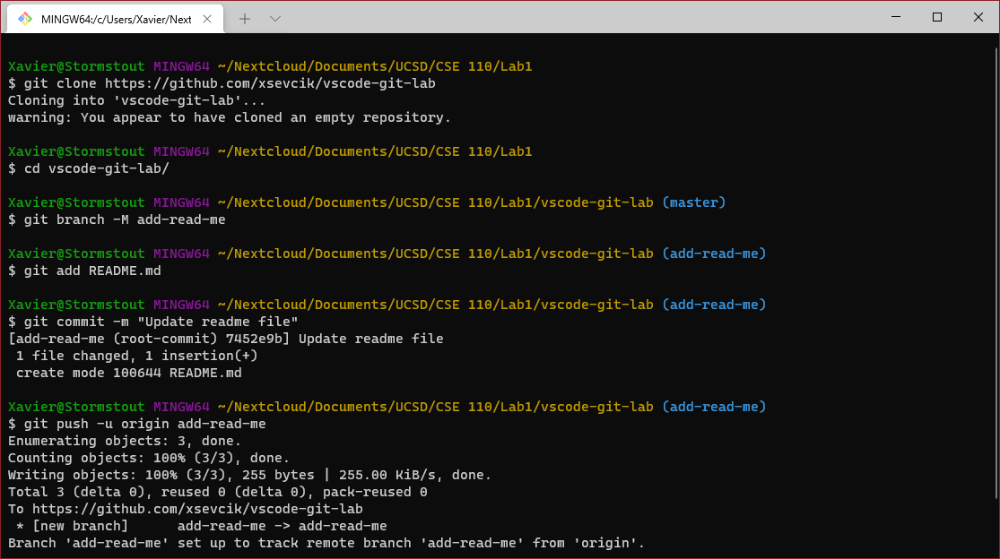

# Welcome to Lab Week 1
## By Xavier Sevcik

To start off I'm going to throw an image of the very beautiful Windows Terminal in here:


### Styling Text
This first part is *really* important because the way we speak needs emphasis. It's just like how Professor Powell speaks in his ~~*really* boring~~ ***really* exciting** lectures, if he didn't vary his tone, sentences could carry completely different meaning.

### Quoting Text
Sometimes you can't always use your own words. That's okay, you just need to give your paper plot armor so that you don't have to do a special brand new Canvas course you didn't sign up for. To do that, you need to make sure you attribute the words to someone else. This is called shifting blame. Here's an example:
> Thou shalt not pollute the standard namespace.
-- Bjorn Toasterstrudel

### Quoting Code
Now let's think about the quote we have from Mr. Toasterstrudel. He warns us against adding things to the standard namespace because that's where the entire standard library lives, and if we wanted to create custom versions of certain commands, we would have collissions. But what is the worst offense at polluting the standard namespace, you may ask? Here:
```C++
using namespace std;
```
The use of this statement is possibly one of the most hotly contested ideas in programming today, right behind whether Python or Pseudocode is more complex.

### External Links
I think the most important part of making beautiful online documents is being able to disguise your hyperlinks so you don't have a bunch of weird tagging on the end that throws off your text alignment and makes everything ugly. So instead of all the gobbledygook after the domain, I can just say here's how you get to the [Assignment on Canvas](https://canvas.ucsd.edu/courses/30736/assignments/361771) and you'll be taken directly there.

### Relative Links
Relative links are neat, but there's not a whole lot to link to in this repo. How about I just link straight to [the README](README.md)? that will be a good one to do. Now don't go crawling the links there unchecked, because I should have a link in there that leads back here. Don't run out of memory on an infinite loop.

### Ordered and Unordered Lists
When we want to do something scientifically, we need to use a certain method to do so. There are steps to take, and the following is a nonexhaustive list:
* Perform and Experiment
* Share your results
* Collect data
* Observe a problem
* Form a hypothesis
* Draw a conclusion

However, I don't think it's a good idea to do these in any order, because sharing your results before you collect data is what you get from old people on Facebook. It should go more like:
1. Observe a problem
2. Form a hypothesis
3. Perform an experiment
4. Collect data
5. Draw a conclusion
6. Share your results

That's how real collaboration happens.

### Task lists
Let's see what we need from the requirements doc...
- [x] [Images](#by-xavier-sevcik)
- [x] [Headings](#welcome-to-lab-week-1)
- [x] [Styling text](#styling-text)
- [x] [Quoting text](#quoting-text)
- [x] [Quoting code](#quoting-code)
- [x] [External Links](#external-links)
- [x] [Section links](#task-lists) (as of the beginning of this list)
- [x] [Relative Links](#relative-links)
- [x] [Ordered and Unordered Lists](#ordered-and-unordered-lists)
- [ ] Task lists

All but...wait! *This* is a task list! I'm so good at this. Looks like that ticks all the boxes.